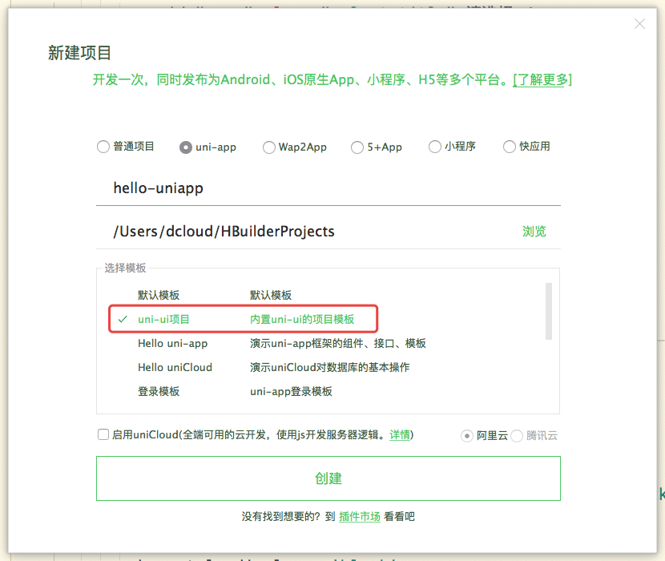

## 创建 uniapp 项目

### 环境搭建（创建项目前需准备）

- 下载安装 HBuilderX

1. HBuilderX 是通用的前端开发工具，但为 uniapp 做了特别强化
2. 下载 App 开发版，可开箱即用
3. [点击下载](https://www.dcloud.io/hbuilderx.html) 后点击页面 DOWNLOAD 按钮即可选择安装

- 安装微信开发者工具（后续开发微信小程序用）
- 如后续开发微信小程序必须使用微信开发者工具打开

1. [点击下载](https://developers.weixin.qq.com/miniprogram/dev/devtools/download.html)

### 创建 uni-app 项目

- 在左上角顶部工具栏中点击->新建->项目->

- 选择 uni-app 类型，输入工程名，选择模板，点击创建即可成功创建一个 uniapp 项目

- uniapp 自带的模板有 Hello uni-app ，是官方的组件和 API 示例，还有一个重要模板是 uni ui 项目模板，日常开发推荐使用该模板，已内置大量常用组件

### 运行 uni-app 项目

#### 浏览器运行 uni-app 项目

- 选择并加载 uniapp 模板后选择左上列表-> 运行 -> 运行到浏览器，则可在浏览器浏览新建的项目

#### uni-app 手机端使运行（真机调试）

- 手机端运行需连接移动端设备（USB 连接即可）
- 选择并加载 uniapp 项目后点击左上列表 -> 运行 -> 运行到手机或模拟器 -> 运行
- 在手机安装项目后打开即可浏览 uniapp 项目

#### uni-app 运行微信小程序

- 选择 uniapp 项目点击左上角列表 -> 运行 -> 运行到小程序或模拟器 -> 微信开发者工具

- 第一次运行微信小程序 需要在微信开发者工具配置小程序的 ide 的相关路径，才能运行成功

- 配置方法：运行微信小程序将微信开发者工具本机地址放到微信开发者工具路径上即可

- 如果运行报错
- 微信开发者工具配置：工具 -> 设置 -> 安全设置 ，将服务器端口开启

### uniapp 文件介绍

##### pages

* 存放 uniapp 页面

##### static

* 存放静态资源 （图片，视频，字体，图标）

##### unpackage

* 存放打包后的文件

##### App.vue

* 项目根组件，页面的入口文件，所有文件在此跳转

##### main.js

* 项目的入口文件，项目加载时首先加载

##### manifest.json

* 配置应用打包的配置文件

##### pages.json

* 设置项目页面存放路径，及窗口外观

##### uni.scss

* 常用的样式变量

### uni 开发规范

- 为了实现多端兼容，综合考虑编程速度，运行性能等因素，uniapp 约定了如下规范

1. 页面文件遵循 Vue 单文件组件(SFC)规范
2. 组件标签接近小程序规范，详见 uni-app 组件规范
3. 接口能力(JS API)靠近小程序规范，但需将前缀 wx 替换为 uni，详见 uni-app 接口规范
4. 数据绑定及事件处理同 Vue.js 规范，同时补充了 App 及页面的生命周期
5. 为兼容多段运行，建议使用 flex 布局进行开发